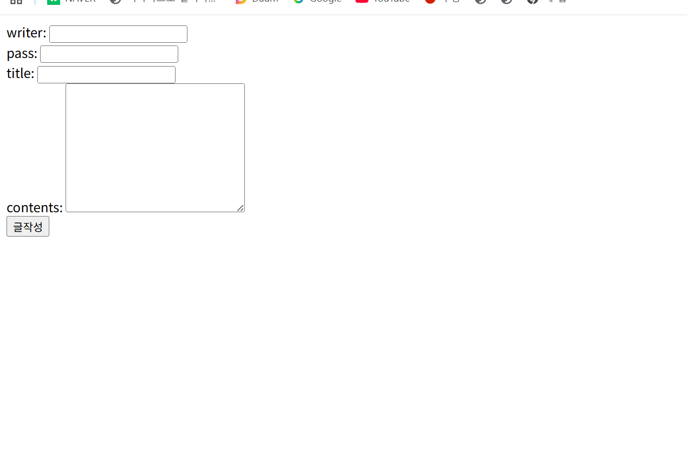
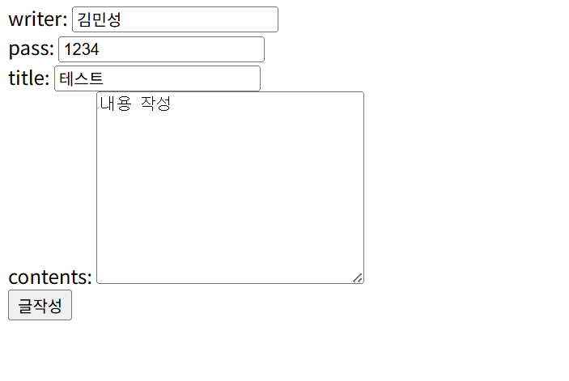
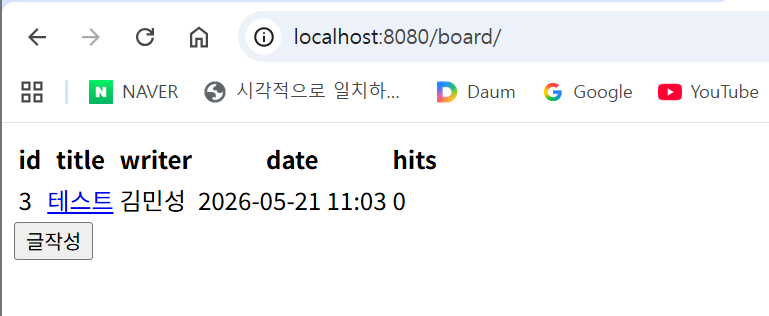
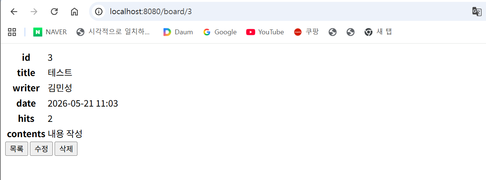
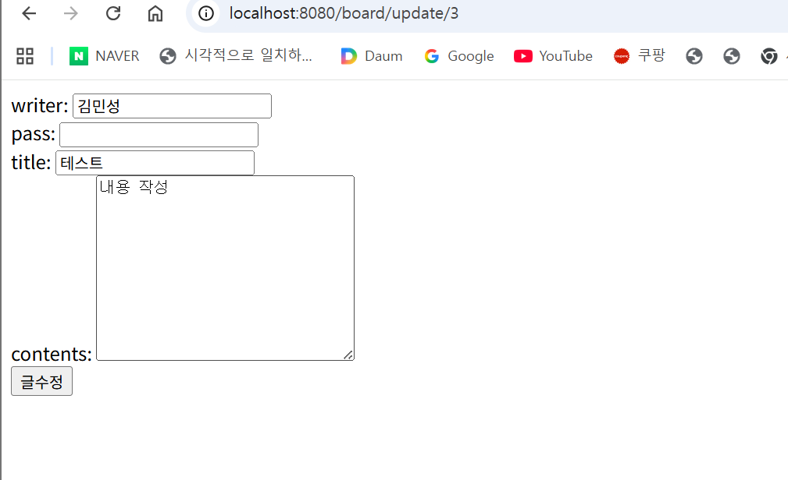
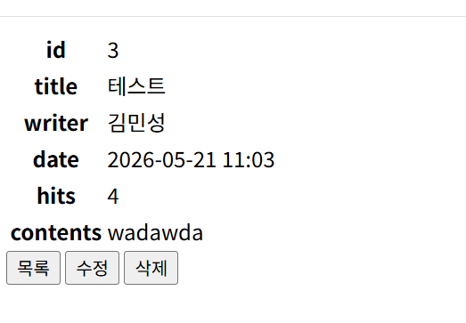

# CRUD 게시판 만들기
## CRUD 게시판 이란?
### C: 생성
### R: 조회
### U: 수정
### D: 삭제
### CRUD는 가장 기초적인 틀로, CRUD로 만든 게시판을 CRUD 게시판이라고 한다.
---
---

# 개념 정리

## JSON
#### 데이터를 주고받을 때 사용하는 형식.


## 계층형 구조
#### Controller, Service, Repository 등 역할에 따라 나누어 개발하는 구조
## DTO
#### 데이터 전달용 객체

#### Controller ↔ Service 사이에서 데이터 전달할 때 사용.
## Entity

#### DB 테이블과 연결되는 객체

#### MySQL 테이블 구조를 자바 클래스로 만든 것.

## Controller 
#### 사용자의 요청(URL)을 받아 처리하는 역할을 한다. 
* @GetMapping 데이터 조회(가져오기) 할 때 사용.
```
@GetMapping("/")
public String index() {
    return "index";
}
```
* @PostMapping 데이터 저장할 때 사용. 
```
@PostMapping("/save")
public String save(BoardDTO boardDTO) {

}
```
* @PutMapping
PUT 요청 처리 (전체 수정)

기존 데이터를 수정할 때 사용.

```
@PutMapping("/board/update/{id}")
public String update(@PathVariable Long id) {

}
```
* @DeleteMapping
DELETE 요청 처리 (삭제)

데이터 삭제 시 사용.

```
@DeleteMapping("/board/delete/{id}")
public String delete(@PathVariable Long id) {

}
```
* @RequestMapping
기본 URL 설정 및 여러 요청 방식 처리.

```
@RequestMapping("/board")
public class BoardController {

}
```


#### 등을 사용하여 페이지 이동과 기능 실행을 처리하였다
## Service

#### ``` boardService.save(boardDTO)``` 실제 기능을 처리
#### 예시:
* 저장
* 수정
* 삭제
## Repository
#### ```boardRepository.save()``` DB 접근 담당 MySQL 저장/조회 담당함
---
---
### @(annotation)
#### 코드의 역할을 알려주는 표시    ```@Controller ``` 는 스프링한테 이 클래스가 요청을 처리하는 클래스 라고 전달해 준다
#### ```@RequestMapping("/board")``` 공통 주소 설정 즉 
* /board/save 
* /board/update
* /board/1
#### 처럼 /board부터 시작하게 함

#### ```@GetMapping("/save")``` 페이지 요청을 처리한다 주로 
* 화면이동 , 조회 등  사용
#### ```@PostMapping   ``` 데이터 저장 / 수정 요청 처리
* 저장(Create)
* 수정(Update)
할 때 사용.
예시:
``` 사용자가 작성 버튼 클릭 -> DB 저장```

#### ```@PathVariable Long id```
URL 값 가져오기
* /board/3
#### URL 에서 값을 가져온다 그러면 id = 3이 된다.

#### ``` Model model ``` Controller -> HTML 데이터 전달
``` model.addAttribute("board",boardDTO)```  HTML 에서: ``` ${board.boardTitle} 라는 식으로 사용 가능 


## CRUD 게시판 동작 

* writer: 작성자 (글쓴이 이름)
* pass: 비밀번호  (글을 수정 하거나 삭제할 때 필요)
* title: 제목 (글의 제목)
* contents: 내용 (글의 본문 내용)

---
-> 작성

-> 작성 후 게시글 목록으로 이동

-> 테스트 타이틀 클릭

목록-> 게시글 목록으로 되돌아감


수정 클릭 -> 


내용 수정 후 비밀번호 작성  틀릴시 수정 못함 

수정 클릭->  수정 완료



## Database(MySQL)

### 
```
create database db_codingrecipe; 
```
라는 데이터 베이스 생성
```
create user user_codingrecipe@localhost identified by '1234';
```
→ 데이터베이스에 접속할 사용자 생성
```
grant all privileges on db_codingrecipe.* to user_codingrecipe@localhost;
```
→ 생성한 사용자에게 db_codingrecipe 데이터베이스의 모든 권한 부여
#### Spring Boot와 MySQL(DB)를 연결하여 게시글 데이터를 저장하고 조회하였다.